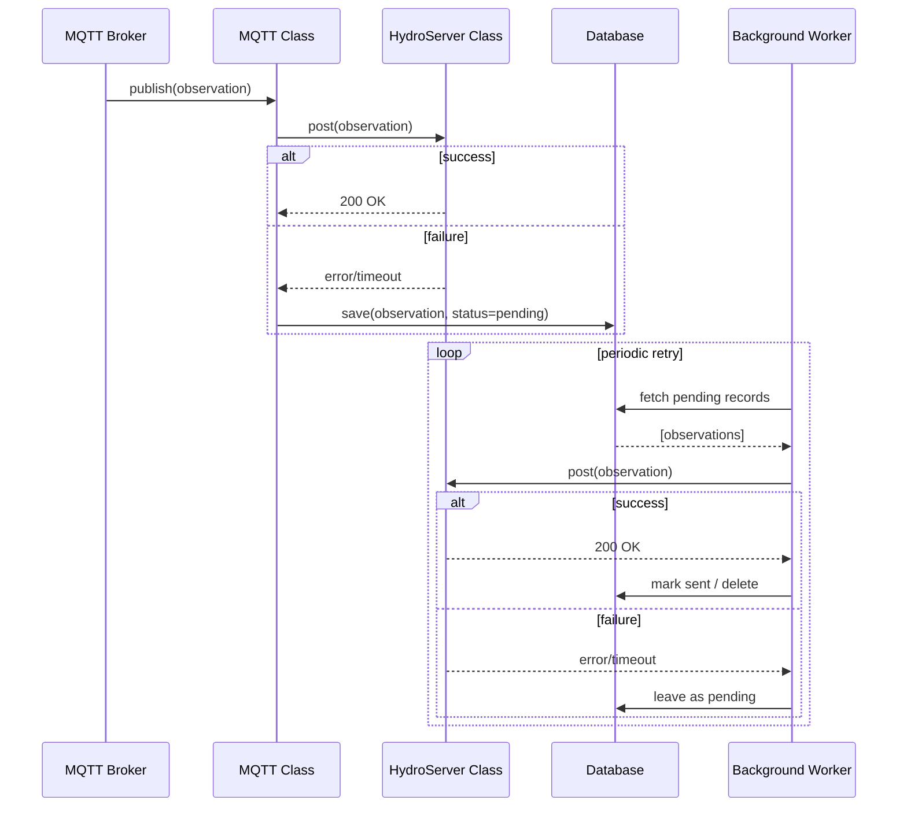

## Sequence Diagram

```mermaid
sequenceDiagram
    participant Broker as MQTT Broker
    participant MQTT as MQTT Class
    participant HS as HydroServer Class
    participant DB as Database
    participant Worker as Background Worker

    Broker->>MQTT: publish(observation)
    MQTT->>HS: post(observation)
    alt success
        HS-->>MQTT: 200 OK
    else failure
        HS-->>MQTT: error/timeout
        MQTT->>DB: save(observation, status=pending)
    end

    loop periodic retry
        Worker->>DB: fetch pending records
        DB-->>Worker: [observations]
        Worker->>HS: post(observation)
        alt success
            HS-->>Worker: 200 OK
            Worker->>DB: mark sent / delete
        else failure
            HS-->>Worker: error/timeout
            Worker->>DB: leave as pending
        end
    end
```
