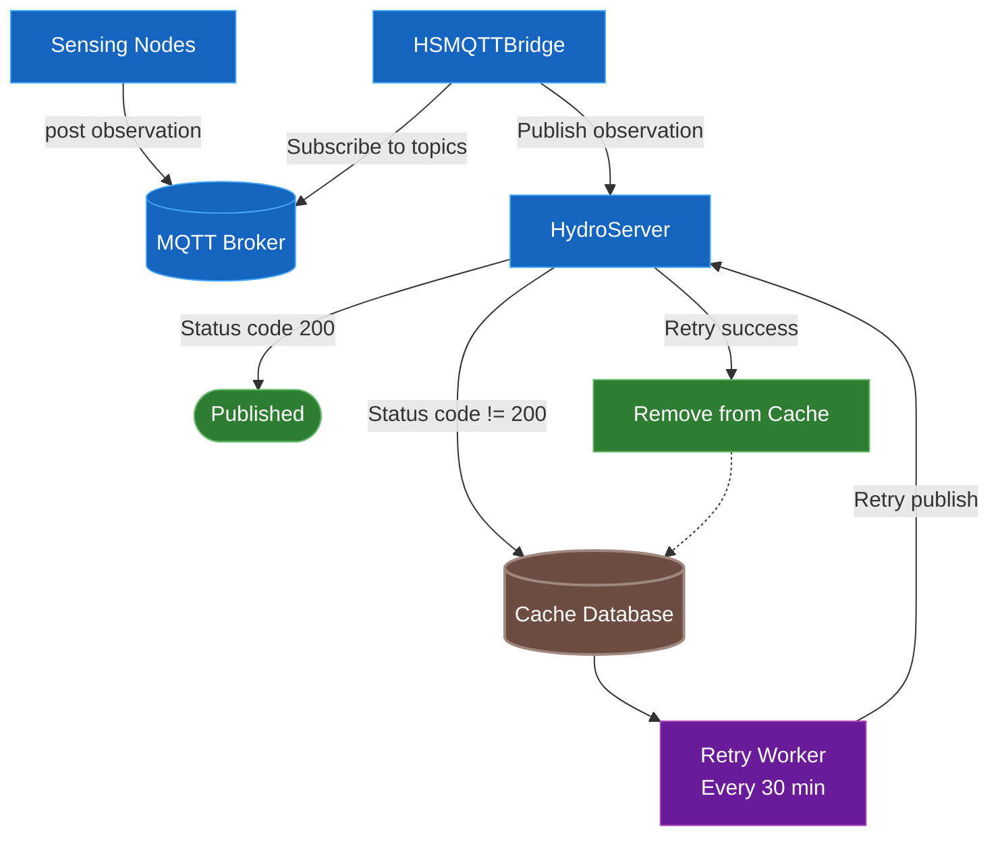

```mermaid
flowchart TD
    SENS["Sensing Nodes"]
    MQTT[("MQTT Broker")]
    BRIDGE["HSMQTTBridge"]
    HYDRO["HydroServer"]
    DB[("Cache Database")]
    WORKER["Retry Worker<br/>Every 30 min"]

    SENS -->|post observation| MQTT
    BRIDGE -->|Subscribe to topics| MQTT
    BRIDGE -->|Publish observation| HYDRO

    HYDRO -->|Status code 200| DONE([Published])
    HYDRO -->|Status code != 200| DB

    DB -->WORKER
    WORKER -->|Retry publish| HYDRO

    HYDRO -->|Retry success| COMPLETE["Remove from Cache"]
    COMPLETE -.-> DB

    style SENS fill:#1565C0,stroke:#42A5F5,color:#FFFFFF
    style MQTT fill:#1565C0,stroke:#42A5F5,color:#FFFFFF
    style BRIDGE fill:#1565C0,stroke:#42A5F5,color:#FFFFFF
    style HYDRO fill:#1565C0,stroke:#42A5F5,color:#FFFFFF

    style DB fill:#6D4C41,stroke:#A1887F,color:#FFFFFF,stroke-width:2px
    style WORKER fill:#6A1B9A,stroke:#AB47BC,color:#FFFFFF

    style DONE fill:#2E7D32,stroke:#66BB6A,color:#FFFFFF
    style COMPLETE fill:#2E7D32,stroke:#66BB6A,color:#FFFFFF
```
