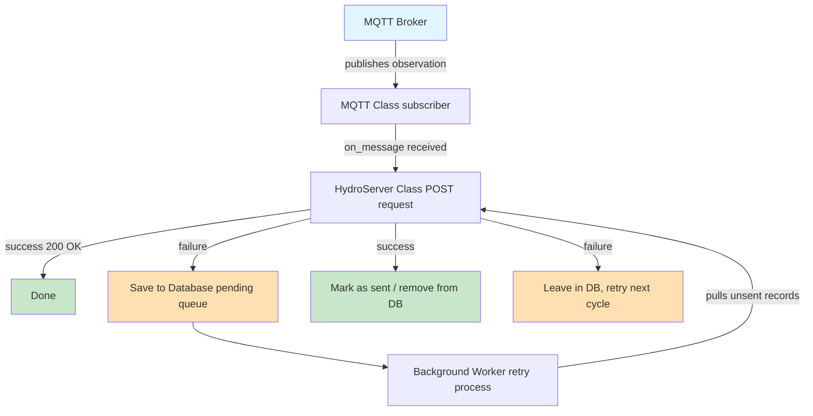

```mermaid
flowchart TD
    A[MQTT Broker] -->|publishes observation| B[MQTT Class subscriber]
    B -->|on_message received| C[HydroServer Class POST request]
    C -->|success 200 OK| D[Done]
    C -->|failure| E[Save to Database pending queue]
    E --> F[Background Worker retry process]
    F -->|pulls unsent records| C
    C -->|success| G[Mark as sent / remove from DB]
    C -->|failure| H[Leave in DB, retry next cycle]

    style A fill:#e1f5fe
    style D fill:#c8e6c9
    style G fill:#c8e6c9
    style E fill:#ffe0b2
    style H fill:#ffe0b2
```
