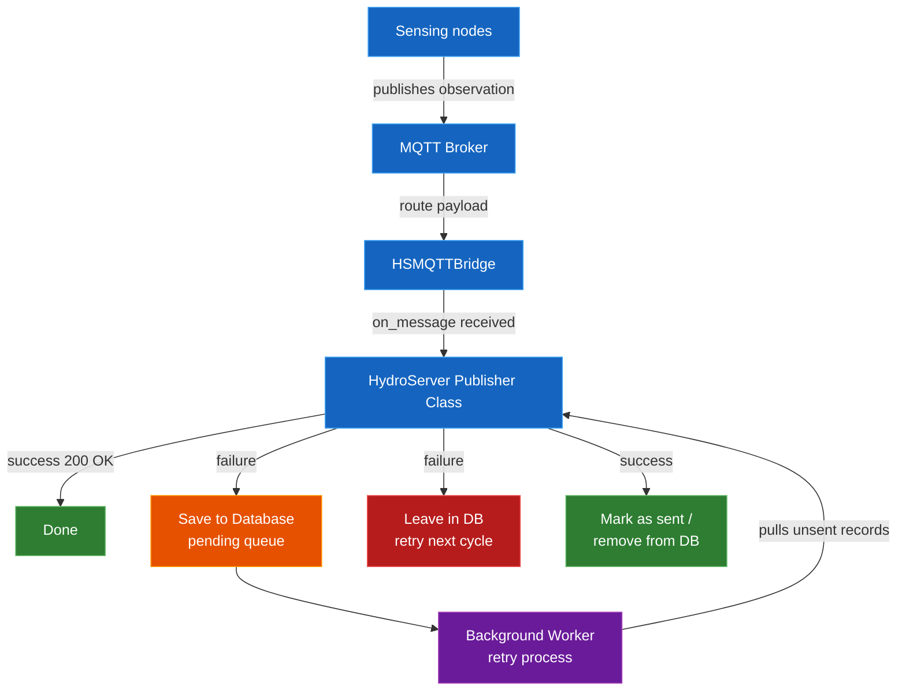

```mermaid
flowchart TB
    X["Sensing nodes"] -- publishes observation --> A["MQTT Broker"]
    A["MQTT Broker"] -- route payload --> B["HSMQTTBridge"]
    B -- on_message received --> C["HydroServer Publisher Class"]
    C -- success 200 OK --> D["Done"]
    C -- failure --> E["Save to Database<br>pending queue"] & H["Leave in DB<br>retry next cycle"]
    E --> F["Background Worker<br>retry process"]
    F -- pulls unsent records --> C
    C -- success --> G["Mark as sent /<br>remove from DB"]

    style A fill:#1565C0,stroke:#42A5F5,color:#FFFFFF
    style B fill:#1565C0,stroke:#42A5F5,color:#FFFFFF
    style C fill:#1565C0,stroke:#42A5F5,color:#FFFFFF
    style D fill:#2E7D32,stroke:#66BB6A,color:#FFFFFF
    style E fill:#E65100,stroke:#FF9800,color:#FFFFFF
    style F fill:#6A1B9A,stroke:#AB47BC,color:#FFFFFF
    style G fill:#2E7D32,stroke:#66BB6A,color:#FFFFFF
    style H fill:#B71C1C,stroke:#EF5350,color:#FFFFFF
    style X fill:#1565C0,stroke:#42A5F5,color:#FFFFFF
```
